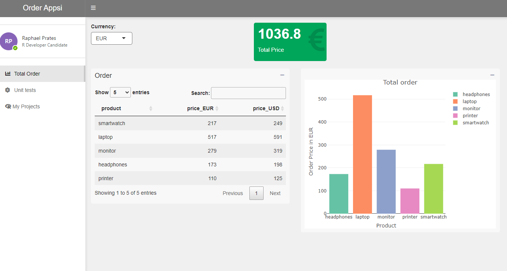

```{r setup, include=FALSE}
knitr::opts_chunk$set(echo = TRUE)
```

This app contains 3 tabs:

* Total Order: displaying a input select, data table and reactive value box and a ploty plot;
* Unit tests: a solution of a coding exercise about unit tests;
* My Projects: other projects developed when I was working at LG

```{r, echo=FALSE,out.width='75%', fig.align='center'}

```

