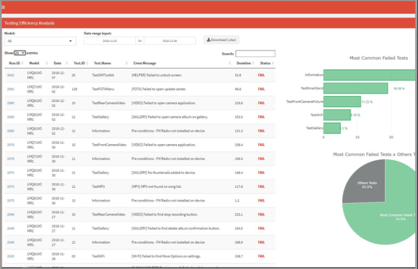
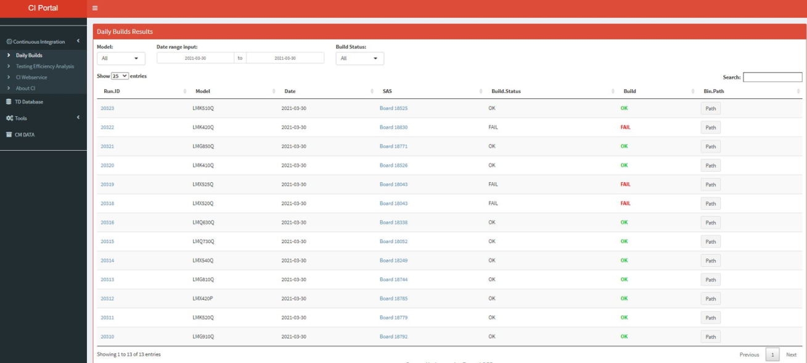
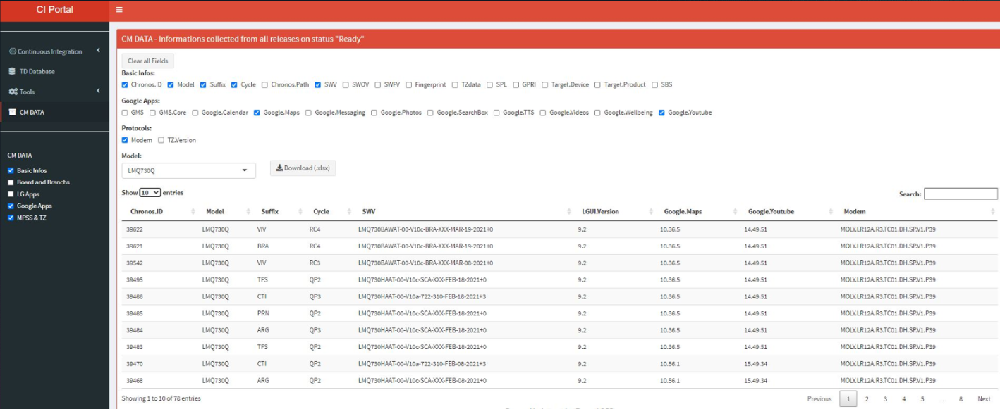
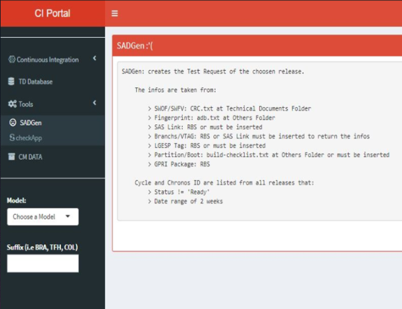
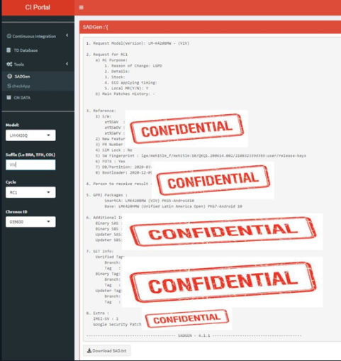
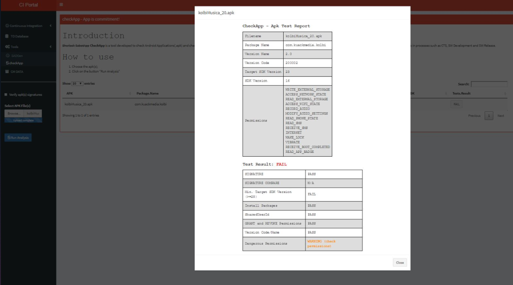

```{r setup, include=FALSE}
knitr::opts_chunk$set(echo = TRUE)
```

## Introduction

I worked in Integration team and the main activities of this role were:

* Releasing final Software of LG Smartphones for LATAM market; 
* Performing SW Integration using GIT and Gerrit (Android/Java);
* Adapt compilation script using Bash;
* Developing new tools to automate integration, deploy, and configuration management processes using mostly R to grep information about software’s details and R Shiny (R, HTML, CSS) for data visualization.

These tools were developed when I was working at LG Electronics.  
Sorry for the bad quality of the images, they were taken from an old document.  

### Testing Efficiency Analysis

This web app collects the testing results in **.xml** and creates data frames with these results.  
After this, the app plots the results to discover the most common failed tests.  

```{r, echo=FALSE,out.width='100%', fig.align='center'}

```

### Daily Builds

Collects data from webservice/JSON and creates data frames with the results.  
In this data table, there are *hyperlinks* and modal dialogs.

```{r, echo=FALSE,out.width='100%', fig.align='center'}

```

### CM Data

Collects data from webservice/JSON, *txt* files, *csv* and creates data frames with these results.  
This tool helped a lot in the process of identifying which smartphones were affected by a particular bug.  
  
We can see a conditional panel that turns on lists of variables. Unchecking the checkbox will remove that variable from the displayed dataset.  

```{r, echo=FALSE,out.width='100%', fig.align='center'}

```

### SADGEN - Test Request file generator

Collects data from webservice/JSON, *txt* files, *csv* and creates the Test Request file of the chosen release.  
The Test Request file could be downloaded using this R Shiny app.  

```{r, echo=FALSE,out.width='75%', fig.align='center'}

```

```{r, echo=FALSE,out.width='75%', fig.align='center'}

```

### CheckApp

Checkapp is a tool where a apk must be upload using the "Browse" button in the conditional panel. After uploading the app and clicking on the "Run Analysis" button, the tool runs some script to extract the AndroidManifest.xml of the apk and validates it according to Google rules to allow it to be embedded in Android Smartphones.   

```{r, echo=FALSE,out.width='75%', fig.align='center'}

```
